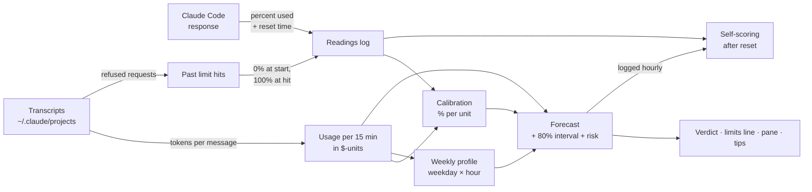

# limits-forecast

A Claude Code mod that forecasts your 5‑hour and weekly usage limits, learns your usage pattern and suggests what to change before you run out.


---

## What you get

### Limits line above the prompt

```
5h ███▓▓▒··│·· 42% ↻ 2h30 → 68% (61–77) risk 0% ● OK   │   wk █████▓▓▓│▒▒ 61% ↻ 3d → 104% (88–119) risk 75% ● SLOW DOWN   · 14:02
```

| Field | Meaning |
| --- | --- |
| `· 14:02` | When Claude Code last reported your limits. Claude Code gets them with each response, so they update when you send a message; usage in other sessions or on claude.ai shows up after your next one. |
| `5h` / `wk` | The 5-hour window and the weekly window. |
| `███▓▓▒··│··` | A small version of the [pane's bar](#limits-pane), 0–125% in 10 cells. Left out when the terminal is too narrow for the line. |
| `42%` | Used now, exactly as Claude Code reports it. |
| `↻ 2h30` | Time until the window resets (`1d 23h` beyond a day). |
| `→ 68%` | **Point forecast**: the expected percent at reset. |
| `(61–77)` | **80% prediction interval**: the final value lands in this range about 8 times out of 10. |
| `risk 0%` | **Probability** of reaching 100% before the reset. |
| `OK` / `SLOW DOWN` / `HOLD ON` | The verdict (rules [below](#verdicts)). |

The fields are the same whatever the verdict. A `–` means *not known yet*, for example before the mod has learned enough. Colors:

- **Verdict:** OK green, SLOW DOWN yellow, HOLD ON red.
- **Forecast:** green, yellow when it is at 90% or more or its range reaches past 100%, red when it is over 100%. So a tight window stands out even while the verdict is OK.
- **Bar:** the used part in the verdict color, the rest dim.

When a window is under pressure, the warning headline, the top suggestions and two buttons appear under the line: **Hide** keeps the warning away until the situation changes (the line stays); **Details** opens the pane.

### `/limits-forecast` pane

```
5-hour   ████████▓▓▓▓▓▓▒·····│·····
  used          42% now
  resets        in 2h30 · 16:32
  at reset      ~68%  ·  80% range 61–77%  (from 12 past days)
  risk          0% chance to run out before the reset
  speed         9.1%/h over your last hour
  even pace     50% by now · you are under by 8
```

- **The bar** runs from 0 to 125% in 5% cells. `█` is used, `▓` runs up to the forecast at the reset, `▒` from there to the top of the 80% range, and `│` marks the limit at 100%. It's a fan chart in one row: it draws the side of the range that decides whether you hit the limit, and the numbers next to it give the whole range.
- **Suggestions** (see [below](#suggestions)).
- **Learning:** how many tokens make one percent and its standard error (or the assumed one, and whether it re-learned after a change), the Opus weight check and whether it's applied, what the replay tuned per window, and how regular your weeks are. Each row says what data it is still waiting for.
- **Forecast quality:** the [scores](#how-it-scores-itself) in plain words.
- **History:** transcripts read, your past limit hits and hours blocked, your busiest days, and your past weeks in percent.

The VS Code extension draws no plugin panes or bands, so there `/limits-forecast` prints the same report as text. It goes by whether anything of the mod has been drawn yet. `/limits-forecast text` asks for the text version anywhere.

### `/limits-forecast export`

This writes 13 CSV tables and a `summary.json` for retrospectives. The files are listed under [Your data](#your-data).

### Toasts

You get a toast when the verdict gets worse, and when a window crosses 80% and 90%.

---

## Install

At the prompt of a Claude Code session:

```
/plugin install limits-forecast --marketplace <owner>/limits-forecast
```

Or from a local clone:

```
/plugin install limits-forecast --marketplace C:\path\to\limits-forecast
```

Answer `y` to add the marketplace, then choose user scope so it runs in every session.

After changing the code of a local install, run `/reload-plugins`. There's nothing to rebuild and no version to bump, because a local marketplace is read straight from the folder.

To try it without installing:

```
claude --plugin-dir ./plugins/limits-forecast
```

> **Requirements:** a Claude Code build with mod support (developed on 2.1.292) and a subscription plan. Only subscription plans report rate-limit windows.

---

## Model calls and network

| Question | Answer |
| --- | --- |
| Does it call Claude or any other model? | **No.** The code never touches `$.model`. |
| Does it send data anywhere? | **No.** There are no HTTP calls. It reads local files and writes to `~/.claude/limit-metrics/`. |
| Does it use your limit? | **No.** It costs nothing from the limits it watches. |
| How does it learn? | By fitting a few numbers to your history with the formulas under [The math](#the-math). |

---

## How it works



1. **Readings.** After each response Claude Code reports every limit window (`five_hour`, `seven_day`) with the percent used and the reset time. The mod logs each move of a window.
2. **Usage.** Every 5 minutes (and 1 second after start) the mod reads all sessions' transcripts in `~/.claude/projects` and sums the tokens per 15-minute bucket, converted to [units](#1-units-tokens--dollars). Unchanged files come from a cache. Files over the runtime's 4 MiB read limit are streamed through `cat` (`type` on Windows), keeping only the lines the parser needs.
3. **Past hits.** When you ran out, Claude Code wrote the refused request into the transcript with `error: "rate_limit"` and `quotaLimits { rateLimitType, resetsAt }`. Each hit becomes two exact readings: 0% when the window started and 100% at the hit. So if you've ever hit a limit, calibration works from day one.
4. **Calibration** learns how many percent one unit costs, separately for each window.
5. **Profile** learns when you usually work: weekday totals times an hour-of-day shape.
6. **Forecast** combines your usual pattern, today's deviation from it and the spread of your past weeks.
7. **Self-scoring** compares every logged forecast with the final percent once its window resets.
8. **Self-tuning** replays past weeks to learn the settings the forecast uses: how fast bursts fade, how much recent weeks count, any bias, and how wide the range must be to hold 80%.

---

## The math

### 1. Units: tokens → dollars

Different tokens cost the limit different amounts. Tokens are weighted by the ratios of Anthropic's published API list prices ([pricing](https://platform.claude.com/docs/en/about-claude/pricing)):

```math
u \;=\; f_{\text{model}}\cdot\frac{\text{in} + 1.25\,\text{cache\_write} + 0.1\,\text{cache\_read} + 5\,\text{out}}{10^6},
\qquad f_{\text{Opus}}=5,\; f_{\text{Sonnet}}=3,\; f_{\text{Haiku}}=1
```

One unit is about one US dollar at API list prices. It isn't what your subscription costs.

Each message is counted once per message id, because Claude Code writes every content block of a message as its own line with the same usage. Usage is summed into 15-minute buckets with a prefix-sum index, so the usage between any two moments is an O(log n) lookup. The two edge buckets are prorated. *(`units`, `usageIndex` in `model.ts`)*

### 2. Calibration: percent per unit (ratio estimator)

Anthropic doesn't publish how usage maps to percent, so the mod estimates it. Take every **stretch** between two readings of the same window. A stretch must last at least 1 h for the 5-hour window and 12 h for the weekly one. For stretch $i$:

- $y_i$ = percent points moved
- $x_i$ = units used by all local sessions in that stretch
- $w_i = 2^{-\text{age}_i / 14\,\text{d}}$: exponential recency weighting, half-life 14 days, looking back 28 days

The model is $y_i = k\,x_i + \varepsilon_i$ with $\operatorname{Var}(\varepsilon_i) \propto x_i$, since larger stretches are noisier in absolute terms. Weighted least squares through the origin under that model is the **ratio estimator** (Cochran, *Sampling Techniques*, ch. 6):

```math
\hat k \;=\; \frac{\sum_i w_i\,y_i}{\sum_i w_i\,x_i}
```

Its standard error comes from the residuals, with a small-sample correction $n/(n-1)$:

```math
s^2 = \frac{n}{n-1}\cdot\frac{\sum_i w_i\,(y_i-\hat k x_i)^2 / x_i}{\sum_i w_i},
\qquad
\operatorname{SE}(\hat k) = \sqrt{\frac{s^2 \sum_i w_i^2\,x_i}{\left(\sum_i w_i x_i\right)^2}}
```

Rules:

- $\hat k$ is used once the stretches add up to ≥ 3 percent points.
- The SE needs ≥ 3 stretches. Until then an SE of 25% of $\hat k$ is **assumed**, so that the range doesn't treat a conversion learned from a single limit hit as exact. The pane marks it as assumed.
- Stretches with points moved but no local usage are dropped. That usage came from claude.ai or another machine.

**Change detection.** A new plan, or Anthropic changing the limits, makes the old stretches wrong. Waiting for them to fade out of the 28 days would take weeks. So when the **two latest stretches both miss the fit on the same side**, each by more than

```math
\max\!\Big(30\%,\ 3\,\tfrac{\operatorname{SE}(\hat k)}{\hat k},\ \tfrac{2}{y_i}\Big)
```

the mod learns from those two alone. The last term allows for small stretches being coarse, since windows move in whole points. A single odd stretch is treated as noise. The pane says when it re-learned.

*(`calibrate`, `ratioFit`)*

### 3. Opus weight check (two-variable WLS + delta method)

Is Opus really 5/3 as expensive as Sonnet *against the limit*? Using the same stretches, the mod fits Opus and non-Opus usage separately, again through the origin with weights $w_i / (x_{1i}+x_{2i})$:

```math
y_i = a\,x_{\text{opus},i} + b\,x_{\text{other},i} + \varepsilon_i
```

and reports $a/b$:

- 1.0 means the assumed weight is right.
- 1.3 means Opus costs 30% more of the limit than assumed.

The standard error of the ratio comes from the delta method:

```math
\operatorname{Var}\!\left(\tfrac{a}{b}\right) \approx \frac{\operatorname{Var}(a)}{b^2} + \frac{a^2\operatorname{Var}(b)}{b^4} - \frac{2a\operatorname{Cov}(a,b)}{b^3}
```

It needs ≥ 6 stretches, and both kinds of usage must vary independently, which the determinant check enforces. Otherwise the split can't be identified and the check stays silent.

Once the ratio is **clearly** different from 1, Opus usage is counted with it everywhere: the conversion, the profile and the forecast. "Clearly" means more than 2 standard errors away from 1, and measured to within 25%. *(`weightCheck`, `ratioOfTwo`, `opusWeight`, `reweightOpus`)*

### 4. Weekly profile (multiplicative weekday × hour model)

A raw 168-cell hour-of-week table would be mostly empty. Instead the mod uses a factorized (multiplicative) seasonal model with 7 + 24 parameters:

```math
\text{expected}(d, h) \;=\; \bar U_d \cdot s_h
```

- $\bar U_d$ is the recency-weighted mean daily total for weekday $d$ (same 14-day half-life), over the last 8 weeks, complete days only, idle days counted as zero. A weekday with no history falls back to the overall mean.
- $s_h$ is the hour-of-day shape. It is recency-weighted, smoothed with a $[\tfrac14,\tfrac12,\tfrac14]$ kernel over neighbouring hours, and normalized so that $\sum_h s_h = 1$.

*(`profile`, `expectedUnits`)*

### 5. Point forecast (profile + mean-reverting deviation)

Let $H$ be the hours to reset, $p$ the percent used now, and $L$ the look-back: 1 h for the 5-hour window, 24 h for the week.

- Usual usage until reset: $U_{\text{usual}} = \int_{\text{now}}^{\text{reset}} \text{expected}(t)\,dt$
- Today's deviation: $\Delta = \dfrac{U_{\text{last }L}}{L} - \dfrac{U^{\text{expected}}_{\text{last }L}}{L}$ (units per hour)

A burst doesn't last until the reset, and a slow morning doesn't either. So the deviation decays exponentially (mean reversion) with time constant $\tau$: 1 h for the 5-hour window, 12 h for the week. Integrated over the time left:

```math
B = \max\!\Big(0,\; U_{\text{usual}} + \Delta\,\tau\,\big(1-e^{-H/\tau}\big)\Big),
\qquad
\hat P = p + \hat k\,B
```

The model forecast needs $\hat k$, at least 3 days of history and a known reset time. Until then the forecast is the baseline below. *(`forecast`)*

### 6. Baseline: "the current speed holds"

```math
\text{rate} = \frac{\hat k\,U_{\text{last }L}}{L},
\qquad
P_{\text{baseline}} = p + \text{rate}\cdot H
```

Before $\hat k$ is known, the rate is the ordinary least-squares slope of the readings themselves. That needs ≥ 3 readings spanning ≥ $L/4$. The baseline does two jobs:

- It's the naive benchmark the skill score compares against.
- It feeds the "you hit the limit in ~40 m" warning.

*(`readingRate`, `slope`)*

### 7. 80% prediction interval and risk (kernel density estimate)

How much could the rest of this window differ from the forecast? The mod looks at how the same stretch went in the past:

- Weekly window: the same stretch (now → reset) in each of up to 9 previous weeks.
- 5-hour window: the same clock stretch on up to 14 previous days of the same kind (workday or weekend), looking back 28 days.

From the past usages $u_j$ with mean $\bar u$, build one scenario per past stretch, with the same forecast and that stretch's deviation from normal:

```math
S_j = p + \hat k\cdot\max\!\big(0,\; B + u_j - \bar u\big)
```

The scenarios are smoothed into one distribution, a **Gaussian kernel density estimate**. Each scenario gets a kernel whose width $\sigma$ combines **Silverman's rule-of-thumb bandwidth** $h$ with the uncertainty of $\hat k$ (the two error sources treated as independent):

```math
F(x) = \frac1n\sum_j \Phi\!\left(\frac{x - S_j}{\sigma}\right),
\qquad
\sigma = \sqrt{h^2 + \big(\operatorname{SE}(\hat k)\,B\big)^2},
\qquad
h = 0.9\,\min\!\big(s,\ \tfrac{\text{IQR}}{1.34}\big)\,n^{-1/5}
```

$\Phi$ is the standard normal CDF. The **80% prediction interval** and the **risk** are both read from $F$, so they always agree:

```math
\text{lo} = \max\big(p,\ F^{-1}(0.1)\big),
\qquad
\text{hi} = F^{-1}(0.9),
\qquad
\text{risk} = 1 - F(100)
```

$F^{-1}$ is found by bisection. The interval is clipped below at $p$ because usage never goes back. Smoothing matters with few past stretches: the 10% and 90% sample quantiles of 4 weeks always lie inside the observed weeks, which makes a raw interval too narrow, and a count-based risk could only move in steps of 1/n. If the scenarios don't vary at all, the plain sample quantiles (type 7, Hyndman & Fan 1996) and the plain share at or above 100% are used.

The interval and risk need ≥ 3 past stretches, and the pane says how many it compared with. Regular habits and more history give a narrower range; irregular use gives a wider one.

### 8. Regularity

The coefficient of variation of your complete past weeks (up to 8):

```math
\text{CV} = \frac{s}{\bar x}
```

"Your weeks vary ±48%" means CV = 0.48. *(`regularity`, `cv`)*

### 9. Self-tuning by replaying the past

Several settings above are reasonable guesses: how fast a deviation fades ($\tau$), the profile's half-life, the width of the range. Once an hour the mod checks them against your own history with a **rolling-origin backtest** (time-series cross-validation; Hyndman & Athanasopoulos, §5.10):

1. **Replay.** At past moments (every 2 h for the 5-hour window, every 6 h for the week) it forecasts the usage until the current horizon, using only what was known at that moment, and compares with what happened. This is done in usage units, so no past limit readings are needed.
2. **Point forecast.** It tries $\tau \in \{15\text{ m}, 1, 2, 4\text{ h}\}$ (5-hour) or $\{3, 12, 24, 48\text{ h}\}$ (week), and profile half-lives of $\{7, 14, 28\}$ days. It keeps the pair with the smallest mean absolute error, but **only if it beats the defaults by at least 5%**. A smaller gain over a few weeks is easily noise.
3. **Bias.** With those settings, forecasts are multiplied by $\sum \text{actual} / \sum \text{forecast}$ (a ratio estimator again), clipped to $[0.67, 1.5]$, and ignored when within 5% of 1.
4. **Range width.** The deviations of the past stretches are scaled by a factor $c \in \{0.5, \dots, 4\}$ until the replayed 80% ranges held closest to 80% of the outcomes. This is **calibrating the prediction interval** on held-out data, the idea behind conformal prediction. Ties go to the factor nearest 1. Scaling the deviations also scales the kernel bandwidth, so the range and the risk stay one distribution.

Replayed moments a few hours apart share most of their future, so they are not independent. The mod counts them as $\min\big(n,\ \lfloor \text{span} / \text{horizon} \rfloor + 1\big)$ and **uses tuned settings only from 10 independent cases**. Before that it uses the defaults:
- For the 5-hour window that's after a few days.
- For the week it takes about 6–7 weeks of history: 3 weeks to compare with, plus the replay span.

The pane's "fit" rows show what was learned, for example "range ×2.5 so it held 80% instead of 59%". *(`tune`, `expectedBase`, `scenarios`)*

### Verdicts

| Verdict | When |
| --- | --- |
| **HOLD ON** | ≥ 95% used, or the current speed reaches 100% before the reset *and* within 45 min (5-hour) / 1 day (week). |
| **SLOW DOWN** | risk > 50% (or, before risk exists, point forecast > 100%), or ≥ 85% used. |
| **OK** | Otherwise. |

Only hard data (the limit itself, or the measured speed) can say HOLD ON. A forecast from your usual pattern can only say SLOW DOWN.

### Suggestions

Shown when a window is tight: not OK, or a forecast ≥ 100%, or a risk ≥ 50%. Each one is triggered by a measurement:

| Tip | Trigger |
| --- | --- |
| `/compact` or `/clear` | main context > 120k tokens (every message re-sends it) |
| Switch to Sonnet | Opus > 60% of the last 5 h of usage (Sonnet makes the same limit last ≈ 5/3 ≈ 1.7× longer) |
| Fewer subagents | subagents > 40% of the last 5 h |
| Take a break | only the 5-hour window is in trouble: a break until its reset costs nothing from the week |
| Daily budget | the weekly window is in trouble: $(100 - p) / \text{days left}$ per day |
| Room for big tasks | nothing tight, > 10 points under an even pace this week, forecast < 90% and risk < 25% |

The export records whether each tip was followed within the hour, for example a model switch or the context shrinking after `/compact`.

---

## How it scores itself

Once an hour, each window's forecast is logged. One forecast per window per hour counts, even across sessions. After the window resets, each forecast is compared with the final percent $y$, over the last 28 days.

| Metric | Formula | Good means |
| --- | --- | --- |
| **MAE**: mean absolute error | $\frac1n\sum \lvert \hat P - y\rvert$ | small |
| **Bias**: mean error | $\frac1n\sum (\hat P - y)$ | ≈ 0 (positive means the forecasts ran high) |
| **Coverage** of the 80% interval | share with $\text{lo} - 0.5 \le y \le \text{hi} + 0.5$ | ≈ 80%: far less means overconfident, far more means too cautious |
| **Sharpness**: mean interval width | $\frac1n\sum(\text{hi}-\text{lo})$ | as narrow as coverage allows |
| **Brier score** of the risk (Brier, 1950) | $\frac1n\sum(\text{risk} - \mathbb 1[y \ge 100])^2$ | 0 is perfect, 0.25 is a coin toss |
| **Skill** vs. the baseline | $1 - \dfrac{\text{MAE}_{\text{model}}}{\text{MAE}_{\text{baseline}}}$ | > 0 beats "the current speed holds" |

Notes:

- Forecasts and outcomes are capped at 100% before scoring, since the reported percent can overshoot.
- The ±0.5 tolerance on coverage allows for windows moving in whole points.

The pane shows these in plain words, and `forecasts.csv` has every scored forecast for your own analysis.

---

## Your data

Everything stays in `~/.claude/limit-metrics/` (or `$CLAUDE_CONFIG_DIR/limit-metrics/`).

| File | Contents |
| --- | --- |
| `log-YYYY-MM-<session>.jsonl` | Readings, turns (tokens, context size, duration, interrupted or not), forecasts and events (warnings shown or hidden, tips, pane opened). One file per session and month. Written every 5 minutes and at session end. |
| `rollup-YYYY-MM.json` | Each transcript's usage per day: tokens per model, tool calls, active quarter-hours, project, effort level, attribution (skill, plugin, MCP server, subagent type), turn and thinking time, interrupted answers, compactions and limit hits. Claude Code deletes transcripts after `cleanupPeriodDays` (30 by default); the rollups keep your history. |
| `history-cache.json` | Usage per 15 minutes and limit hits per transcript, keyed by size and modification time. Kept for 10 weeks, also after Claude Code deletes the transcript, so the forecast can compare with up to 9 past weeks. |

### Export (`/limits-forecast export` → `export/`)

| File | Contents |
| --- | --- |
| `usage-daily.csv` | date, project, model, tokens by type, API-equivalent $ |
| `tools-daily.csv` | tool calls per day and project |
| `active-daily.csv` | active hours, turn hours, thinking hours, interrupted answers |
| `effort-daily.csv` | usage per effort level |
| `attribution-daily.csv` | usage per skill, plugin, MCP server and subagent type |
| `compactions.csv` | manual or auto, tokens before and after |
| `limits.csv` | every reading |
| `limit-hits.csv` | every limit hit, including from before the mod was installed, with hours blocked and retries |
| `forecasts.csv` | every forecast with its outcome |
| `turns.csv` | every turn logged live |
| `events.csv` | warnings, hides, pane opens |
| `tips.csv` | each tip shown and whether it was followed |
| `summary.json` | totals, per project, per effort, per attribution, limit hits, compactions, time, forecast quality, warnings |

**Privacy:** only numbers and model, tool and project names are stored. Prompts, answers and code are never stored.

---

## Limitations

- **Plans:** the limit readings exist on subscription plans only, and the first one arrives with the first response of a session.
- **Conversion:** Anthropic doesn't publish the usage → percent formula. The conversion is learned and approximate, and windows move in whole points, so the first stretches are coarse.
- **Other usage:** limit hits and stretches assume the usage came from Claude Code on this machine. claude.ai or another computer in the same window makes the limit look smaller. Stretches with *no* local usage are dropped.
- **History needed:** the interval and risk need a few past weeks (days for the 5-hour window).
- **File size:**
  - Transcripts over 4 MiB are streamed through `cat`/`type`. The pane shows how many couldn't be read.
  - A monthly rollup over 4 MiB stops updating.
- **Timezone:** the weekday profile uses the mod runtime's timezone.
- **Old logs:** they aren't deleted automatically, because mods can't delete files. They're small, so delete old months by hand if you like.

---

## Development

```
claude plugin validate plugins/limits-forecast
claude plugin test plugins/limits-forecast
```

```
plugins/limits-forecast/
├── hooks/
│   ├── stats.ts       # mean, type-7 quantile, CV, OLS slope, ratio estimator, 2-variable WLS
│   ├── model.ts       # units, buckets, transcript parser, calibration, profile, forecast, scoring, limits line text
│   ├── retro.ts       # logs, daily rollups, limit hits, CSV/JSON export
│   └── register.tsx   # wiring: Claude Code events, limits line and warning above the prompt, pane, /limits-forecast command
├── tests/             # model, retro, register and end-to-end flow tests
└── types/index.d.ts   # the mod's state contract
```

The logic lives in pure functions with no I/O, tested in `tests/`. `register.tsx` is the only file that talks to Claude Code.

---

## References

- W. G. Cochran, *Sampling Techniques*, 3rd ed., Wiley, 1977, ch. 6: ratio estimators.
- R. J. Hyndman, G. Athanasopoulos, *Forecasting: Principles and Practice*, 3rd ed., [otexts.com/fpp3](https://otexts.com/fpp3/): prediction intervals, bootstrapped residuals, benchmark methods, forecast accuracy.
- R. J. Hyndman, Y. Fan, "Sample Quantiles in Statistical Packages", *The American Statistician* 50(4), 1996: quantile type 7.
- B. W. Silverman, *Density Estimation for Statistics and Data Analysis*, Chapman & Hall, 1986, §3.4: the rule-of-thumb bandwidth.
- M. Abramowitz, I. A. Stegun, *Handbook of Mathematical Functions*, 1964, 7.1.26: the normal CDF approximation.
- G. W. Brier, "Verification of Forecasts Expressed in Terms of Probability", *Monthly Weather Review* 78(1), 1950.
- T. Gneiting, A. E. Raftery, "Strictly Proper Scoring Rules, Prediction, and Estimation", *JASA* 102(477), 2007: calibration and sharpness.
- G. Casella, R. L. Berger, *Statistical Inference*, 2nd ed., 2002, §5.5.4: the delta method.
- Anthropic, [API pricing](https://platform.claude.com/docs/en/about-claude/pricing): the relative weights of models and token types.
